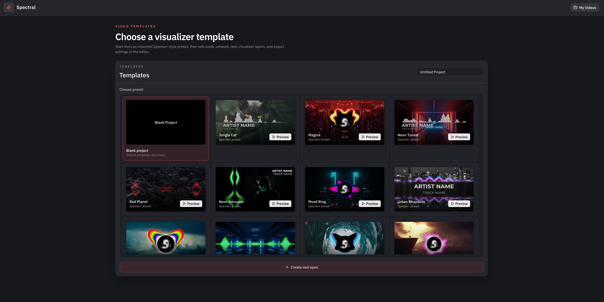
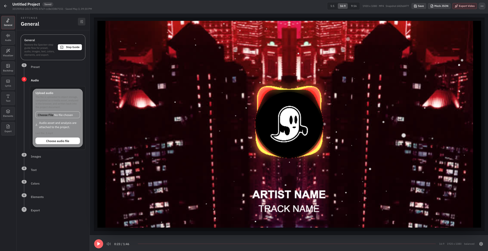
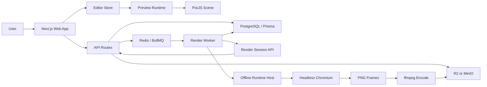

# Spectral

> Audio-reactive video editor and rendering platform.

Spectral 是一个面向音频可视化视频的编辑、预览、导出与后端渲染项目。它把浏览器编辑器、统一项目文档、音频分析、PixiJS 实时预览、Redis 队列、对象存储、离线渲染 runtime 和 worker 导出流程放在同一个 pnpm monorepo 中。

Spectral is a monorepo for building audio-reactive visualizer videos. It combines a browser editor, canonical project documents, audio analysis, PixiJS preview rendering, Redis queues, object storage, an offline render runtime, and a background render worker.

---

## 中文文档

### 项目预览






### 核心目标

Spectral 的核心目标是让前端预览和后端导出尽可能消费同一份项目数据和同一套渲染逻辑。

当前系统支持：

- 模板页创建音频可视化项目
- My Videos 项目列表入口
- 浏览器编辑器实时预览
- 上传音频、图片、视频、logo 等媒体资源
- 音频 waveform / spectrum 分析
- 保存项目快照
- 导出 mock JSON，用于独立调试渲染
- 创建导出任务并进入 Redis 队列
- render worker 消费导出任务
- worker 使用离线 runtime 进行帧渲染、编码和产物上传
- 本地 PostgreSQL、Redis、MinIO 开发环境

### 技术栈

| 层级 | 技术 |
| --- | --- |
| Monorepo | pnpm workspaces, Turbo |
| Web App | Next.js 16 App Router, React 19, TypeScript |
| UI | Tailwind CSS v4, shadcn/ui 风格组件, lucide-react |
| 状态管理 | Zustand stores |
| 实时渲染 | PixiJS, pixi-filters, chroma-js, fontfaceobserver |
| 音频分析 | Web Audio / FFT, waveform, spectrum providers |
| 数据库 | PostgreSQL, Prisma 7 |
| 队列 | Redis, BullMQ |
| 对象存储 | Cloudflare R2-compatible API, MinIO local |
| Worker | Node.js, tsx, Chromium DevTools Protocol, ffmpeg pipeline |
| 环境变量 | dotenvx |
| Docker | Local compose for PostgreSQL, Redis, MinIO, render worker |

### Monorepo 结构

```text
apps/
  web/
    Next.js 前端、API routes、项目编辑器、模板页、My Videos、render bootstrap routes

  render-worker/
    后台导出 worker，消费 Redis 队列，拉取 render session，执行离线渲染和编码

packages/
  audio-analysis/
    音频 waveform / spectrum 分析、provider contract、array-backed analysis 数据

  db/
    Prisma client、repository layer、preset seed/import、data layer

  editor-store/
    项目文档、播放状态、预览状态、UI 面板、导出任务的 Zustand stores

  media/
    R2 / MinIO 适配、签名上传、对象 key 约定、媒体 URL 解析

  project-schema/
    Canonical VideoProject schema、normalize / migrate 逻辑

  queue/
    BullMQ connection、publisher、worker helper、export job data contract

  render-core/
    与平台无关的 frame/time、scene graph、可见性、音频驱动参数计算

  render-runtime-browser/
    浏览器和离线 runtime 使用的 PixiJS 渲染实现、preview/bootstrap/offline entry

  render-session/
    Web API 与 render worker 之间传输的 render session contract

  render-encode/
    导出编码相关 helper

  timeline/
    时间轴 UI primitive、播放头、waveform track、lyrics track

  ui/
    共享 UI 组件

infra/docker/
  compose.local.yml
  compose.render-worker.local.yml
  .env.example

prisma/
  schema.prisma
```

### 架构总览



#### 1. Canonical VideoProject

`@spectral/project-schema` 定义系统最重要的数据结构：`VideoProject`。

它负责统一：

- viewport、aspect ratio、export resolution
- backdrop media、reflection、filter、bounce、vignette
- visualizer logo、wave circles、spectrum、particles
- lyrics segments
- text layers
- audio source、trim、gain、analysis id
- export format、fps、duration

编辑器、API、数据库快照、前端预览、mock JSON、后端 render session 都围绕这份 document 工作。

#### 2. Web App

`apps/web` 是主要产品界面和 API 服务：

- `/`：模板选择页
- `/my-videos`：项目列表页
- `/editor/[projectId]`：编辑器
- `/api/projects`：项目创建和列表
- `/api/assets/*`：媒体上传
- `/api/audio/*`：音频分析
- `/api/projects/[projectId]/exports`：创建导出任务
- `/api/internal/exports/*`：worker 内部 API
- `/render/export/[exportJobId]/bootstrap`：导出渲染 bootstrap/session 入口

前端 UI 只负责交互、状态绑定和用户工作流，渲染逻辑集中在共享 runtime 包里。

#### 3. Preview Runtime 与 Offline Runtime

`@spectral/render-runtime-browser` 同时服务两类环境：

- 浏览器编辑器 preview
- worker 中的 offline runtime host

核心设计是让它们共享尽可能多的 PixiJS 渲染实现，避免“前端一套效果、后端另一套效果”。

主要模块包括：

- `createSpectralRuntimeSession`
- preview stage bootstrap
- render page bootstrap
- offline runtime API
- Pixi layers: backdrop、text、lyrics、particles、visualizer
- media source tracking
- audio analysis provider 注入
- frame capture API

#### 4. Render Worker

`apps/render-worker` 是独立后台服务。它不会由浏览器触发实际渲染逻辑，而是通过 Redis 队列接收任务。

worker 流程：

1. 从 BullMQ 消费 export job
2. 通过 web internal API 获取 render session
3. 准备工作目录和 offline runtime host
4. 启动 Chromium 并加载离线 runtime
5. 按帧调用 runtime 渲染并 capture PNG
6. 使用 ffmpeg 编码视频
7. 生成 poster / preview frame 等 artifact
8. 上传到 MinIO/R2
9. 写入 ExportJob、ExportJobEvent、RenderArtifact

#### 5. API 与 Worker 边界

当前设计是 API 和 worker 逻辑分离：

- Web API 负责用户请求、项目快照、导出任务创建、内部 session API
- Queue 负责异步任务投递
- Worker 负责 CPU/Chromium/ffmpeg 密集型渲染
- Storage 负责输入媒体和输出视频产物

这样可以让 Web App 保持轻量，也能单独横向扩展 worker。

### 主要数据流

#### 项目创建

```text
Template Page -> POST /api/projects -> Project + ProjectSnapshot -> /editor/[projectId]
```

#### 前端预览

```text
VideoProject -> editor-store -> PreviewStage -> createSpectralRuntimeSession -> PixiJS canvas
```

#### 媒体上传

```text
Request signed URL -> upload file to MinIO/R2 -> complete asset -> VideoProject media source
```

#### 音频分析

```text
Audio asset -> analysis API / worker helper -> waveform + bass/wide spectrum -> analysis provider
```

#### 导出任务

```text
Editor export -> save snapshot -> create ExportJob -> enqueue Redis job -> render-worker consumes
```

#### 后端渲染

```text
Worker -> render session bootstrap -> offline runtime -> Chromium frame capture -> ffmpeg encode -> storage upload
```

### 本地启动教程

#### 1. 环境要求

- Node.js `>= 20.18.0`
- pnpm `10.6.0`
- Docker Desktop
- ffmpeg
- Chromium 或 Chrome 可用运行环境

#### 2. 安装依赖

```bash
pnpm install
```

#### 3. 准备环境变量

仓库已经使用 `dotenvx` 加载 `.env` 和 `apps/web/.env.local`。

如果是新环境，可以从示例文件复制：

```bash
cp infra/docker/.env.example infra/docker/.env
```

常用环境变量分组：

```text
DATABASE_URL
SHADOW_DATABASE_URL

REDIS_URL
REDIS_QUEUE_PREFIX

WEB_BASE_URL
INTERNAL_EXPORTS_TOKEN

R2_BUCKET
R2_ACCESS_KEY_ID
R2_SECRET_ACCESS_KEY
R2_ENDPOINT
R2_PUBLIC_BASE_URL
R2_FORCE_PATH_STYLE

EXPORT_MAX_ATTEMPTS
WORKER_CONCURRENCY
```

#### 4. 启动本地基础设施

```bash
pnpm infra:up
```

这会通过 Docker 启动：

- PostgreSQL
- Redis
- MinIO

查看状态：

```bash
pnpm infra:ps
```

停止：

```bash
pnpm infra:down
```

#### 5. 初始化数据库

```bash
pnpm db:generate
pnpm db:push
```

也可以直接运行：

```bash
pnpm setup:local
```

#### 6. 启动 Web App

```bash
pnpm dev:web
```

默认地址：

```text
http://localhost:3000
```

页面入口：

```text
/             模板页
/my-videos    项目列表
/editor        旧项目打开入口
```

#### 7. 启动 Render Worker

另开一个终端：

```bash
pnpm dev:worker
```

这个命令会先构建 offline runtime，然后用 dotenvx 启动 worker。

#### 8. 同时启动 Web + Worker

```bash
pnpm dev:all
```

#### 9. 本地 smoke export

在 Web 和 Worker 都启动后：

```bash
pnpm smoke:export
```

### 常用命令

```bash
pnpm dev:web          # 启动 Next.js web app
pnpm dev:worker       # 启动 render worker
pnpm dev:all          # 同时启动 web 和 worker

pnpm infra:up         # 启动 PostgreSQL / Redis / MinIO
pnpm infra:ps         # 查看 Docker 服务
pnpm infra:down       # 停止 Docker 服务

pnpm db:generate      # Prisma generate
pnpm db:push          # 推送 schema 到数据库
pnpm setup:local      # infra + prisma 初始化

pnpm typecheck        # 全仓库类型检查
pnpm lint             # 全仓库 lint
pnpm build            # 全仓库 build
pnpm smoke:export     # 本地导出链路 smoke test
```

### 开发约定

- 项目文档以 `VideoProject` 为唯一核心契约
- 预览和导出必须尽量复用同一 runtime
- 关键渲染链路避免 fallback 和过期实现
- API routes 保持薄层，业务逻辑放入 service/repository
- Worker 与 Web API 保持服务边界清晰
- 本地开发优先使用 Docker compose，不默认要求 GPU

---

## English Documentation

### Preview


### What Is Spectral?

Spectral is an audio-reactive video editor and rendering platform. It is designed around one central rule: the browser preview and the backend renderer should consume the same project document and reuse as much render logic as possible.

The repository currently includes:

- template-based project creation
- My Videos project listing
- browser-based realtime preview
- media uploads for audio, images, videos, and logos
- waveform and spectrum audio analysis
- immutable project snapshots
- mock JSON export for isolated renderer debugging
- export job creation through the API
- Redis/BullMQ job dispatch
- render worker job consumption
- offline runtime rendering through Chromium
- ffmpeg encoding and artifact upload
- local PostgreSQL, Redis, and MinIO infrastructure

### Tech Stack

| Layer | Stack |
| --- | --- |
| Monorepo | pnpm workspaces, Turbo |
| Web App | Next.js 16 App Router, React 19, TypeScript |
| UI | Tailwind CSS v4, shadcn-style components, lucide-react |
| State | Zustand stores |
| Realtime Rendering | PixiJS, pixi-filters, chroma-js, fontfaceobserver |
| Audio Analysis | Web Audio / FFT, waveform and spectrum providers |
| Database | PostgreSQL, Prisma 7 |
| Queue | Redis, BullMQ |
| Object Storage | Cloudflare R2-compatible API, MinIO for local development |
| Worker | Node.js, tsx, Chromium DevTools Protocol, ffmpeg pipeline |
| Env Loading | dotenvx |
| Docker | Local compose for PostgreSQL, Redis, MinIO, and render worker |

### Repository Layout

```text
apps/
  web/
    Next.js frontend, API routes, editor, templates, My Videos, render bootstrap routes

  render-worker/
    Background worker that consumes Redis jobs, loads render sessions, renders frames, and encodes videos

packages/
  audio-analysis/
    Waveform and spectrum analysis, provider contracts, reusable analysis snapshots

  db/
    Prisma client, repositories, preset import/seed utilities, data layer

  editor-store/
    Zustand stores for project document, playback, preview, UI, and export state

  media/
    R2/MinIO adapter, signed uploads, object key conventions, media URL resolution

  project-schema/
    Canonical VideoProject schema, normalization, and migration

  queue/
    BullMQ connection, publisher, worker helpers, export job data contracts

  render-core/
    Platform-independent frame/time calculations, scene graph building, visibility, audio-driven values

  render-runtime-browser/
    PixiJS render runtime shared by browser preview and offline worker rendering

  render-session/
    Transport contract between the Web API and the render worker

  render-encode/
    Encoding helpers for exported videos

  timeline/
    Timeline UI primitives, playhead, waveform track, lyrics track

  ui/
    Shared UI components

infra/docker/
  compose.local.yml
  compose.render-worker.local.yml
  .env.example

prisma/
  schema.prisma
```

### Architecture


#### 1. Canonical VideoProject

`@spectral/project-schema` defines the canonical `VideoProject` document. It is the contract shared by the editor, API, database snapshots, browser preview, mock JSON export, render sessions, and backend worker rendering.

It covers:

- viewport, aspect ratio, export resolution
- backdrop media, reflection, filters, bounce, vignette
- visualizer logo, wave circles, spectrum, particles
- lyric segments
- text layers
- audio source, trim, gain, analysis id
- export format, fps, duration

#### 2. Web App

`apps/web` contains the main product surface and the API service:

- `/` for templates
- `/my-videos` for project listing
- `/editor/[projectId]` for editing
- `/api/projects` for project creation and listing
- `/api/assets/*` for media uploads
- `/api/audio/*` for audio analysis
- `/api/projects/[projectId]/exports` for export creation
- `/api/internal/exports/*` for worker-only APIs
- `/render/export/[exportJobId]/bootstrap` for render session bootstrap

The frontend owns interaction and state wiring. Rendering logic lives in shared runtime packages.

#### 3. Preview Runtime and Offline Runtime

`@spectral/render-runtime-browser` serves two environments:

- browser editor preview
- worker-side offline runtime host

The goal is render parity. The preview and backend renderer should use the same PixiJS layer implementations wherever possible.

Important parts:

- `createSpectralRuntimeSession`
- preview stage bootstrap
- render page bootstrap
- offline runtime API
- Pixi layers for backdrop, text, lyrics, particles, visualizer
- media source tracking
- audio analysis provider injection
- frame capture API

#### 4. Render Worker

`apps/render-worker` is an independent background service. It consumes Redis jobs and performs rendering outside the browser UI.

Worker flow:

1. consume export jobs from BullMQ
2. fetch render sessions through internal Web APIs
3. prepare a work directory and offline runtime host
4. launch Chromium and load the offline runtime
5. render frames and capture PNG output
6. encode video with ffmpeg
7. generate poster and preview artifacts
8. upload artifacts to MinIO/R2
9. update ExportJob, ExportJobEvent, and RenderArtifact records

#### 5. API and Worker Boundary

The system keeps API and worker responsibilities separate:

- Web API handles user requests, snapshots, export creation, and internal session endpoints
- Queue handles asynchronous dispatch
- Worker handles CPU/Chromium/ffmpeg-heavy rendering
- Storage handles media input and exported artifacts

This keeps the web app lightweight and allows render workers to scale independently.

### Data Flows

#### Project Creation

```text
Template Page -> POST /api/projects -> Project + ProjectSnapshot -> /editor/[projectId]
```

#### Browser Preview

```text
VideoProject -> editor-store -> PreviewStage -> createSpectralRuntimeSession -> PixiJS canvas
```

#### Media Upload

```text
Request signed URL -> upload file to MinIO/R2 -> complete asset -> VideoProject media source
```

#### Audio Analysis

```text
Audio asset -> analysis API / worker helper -> waveform + bass/wide spectrum -> analysis provider
```

#### Export Job

```text
Editor export -> save snapshot -> create ExportJob -> enqueue Redis job -> render-worker consumes
```

#### Backend Rendering

```text
Worker -> render session bootstrap -> offline runtime -> Chromium frame capture -> ffmpeg encode -> storage upload
```

### Local Development

#### 1. Requirements

- Node.js `>= 20.18.0`
- pnpm `10.6.0`
- Docker Desktop
- ffmpeg
- Chromium or Chrome-compatible runtime

#### 2. Install Dependencies

```bash
pnpm install
```

#### 3. Prepare Environment Variables

The repo uses `dotenvx` to load `.env` and `apps/web/.env.local`.

For a new local environment:

```bash
cp infra/docker/.env.example infra/docker/.env
```

Important groups:

```text
DATABASE_URL
SHADOW_DATABASE_URL

REDIS_URL
REDIS_QUEUE_PREFIX

WEB_BASE_URL
INTERNAL_EXPORTS_TOKEN

R2_BUCKET
R2_ACCESS_KEY_ID
R2_SECRET_ACCESS_KEY
R2_ENDPOINT
R2_PUBLIC_BASE_URL
R2_FORCE_PATH_STYLE

EXPORT_MAX_ATTEMPTS
WORKER_CONCURRENCY
```

#### 4. Start Local Infrastructure

```bash
pnpm infra:up
```

This starts:

- PostgreSQL
- Redis
- MinIO

Check status:

```bash
pnpm infra:ps
```

Stop services:

```bash
pnpm infra:down
```

#### 5. Initialize Database

```bash
pnpm db:generate
pnpm db:push
```

Or run:

```bash
pnpm setup:local
```

#### 6. Start Web App

```bash
pnpm dev:web
```

Default URL:

```text
http://localhost:3000
```

Main routes:

```text
/             Templates
/my-videos    Project list
/editor        Legacy open-project entry
```

#### 7. Start Render Worker

Open another terminal:

```bash
pnpm dev:worker
```

This builds the offline runtime first and then starts the worker through dotenvx.

#### 8. Start Web and Worker Together

```bash
pnpm dev:all
```

#### 9. Smoke Export

When both Web and Worker are running:

```bash
pnpm smoke:export
```

### Common Commands

```bash
pnpm dev:web          # Start Next.js web app
pnpm dev:worker       # Start render worker
pnpm dev:all          # Start web and worker

pnpm infra:up         # Start PostgreSQL / Redis / MinIO
pnpm infra:ps         # Inspect Docker services
pnpm infra:down       # Stop Docker services

pnpm db:generate      # Prisma generate
pnpm db:push          # Push schema to database
pnpm setup:local      # Local infra and DB setup

pnpm typecheck        # Typecheck all packages
pnpm lint             # Lint all packages
pnpm build            # Build all packages
pnpm smoke:export     # Local export smoke test
```

### Development Principles

- Keep `VideoProject` as the single core document contract
- Reuse the same runtime for preview and export whenever possible
- Avoid stale rendering fallbacks in critical paths
- Keep API routes thin; put real logic in services and repositories
- Keep Web API and Worker as independent service boundaries
- Optimize for local Docker development first; GPU is not required by default
