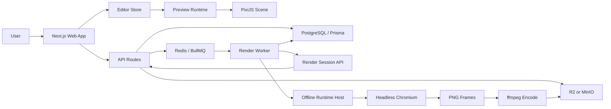

# Spectral

> Audio-reactive video editor and rendering platform.

[中文文档](docs/README.zh-CN.md)

Spectral is a monorepo for building audio-reactive visualizer videos. It combines a browser editor, canonical project documents, audio analysis, PixiJS preview rendering, Redis queues, object storage, an offline render runtime, and a background render worker.

---

## Preview


## What Is Spectral?

Spectral is an audio-reactive video editor and rendering platform. It is designed around one central rule: the browser preview and the backend renderer should consume the same project document and reuse as much render logic as possible.

The repository currently includes:

- template-based project creation
- My Videos project listing
- browser-based realtime preview
- media uploads for audio, images, videos, and logos
- waveform and spectrum audio analysis
- immutable project snapshots
- mock JSON export for isolated renderer debugging
- export job creation through the API
- Redis/BullMQ job dispatch
- render worker job consumption
- offline runtime rendering through Chromium
- ffmpeg encoding and artifact upload
- local PostgreSQL, Redis, and MinIO infrastructure

## Tech Stack

| Layer | Stack |
| --- | --- |
| Monorepo | pnpm workspaces, Turbo |
| Web App | Next.js 16 App Router, React 19, TypeScript |
| UI | Tailwind CSS v4, shadcn-style components, lucide-react |
| State | Zustand stores |
| Realtime Rendering | PixiJS, pixi-filters, chroma-js, fontfaceobserver |
| Audio Analysis | Web Audio / FFT, waveform and spectrum providers |
| Database | PostgreSQL, Prisma 7 |
| Queue | Redis, BullMQ |
| Object Storage | Cloudflare R2-compatible API, MinIO for local development |
| Worker | Node.js, tsx, Chromium DevTools Protocol, ffmpeg pipeline |
| Env Loading | dotenvx |
| Docker | Local compose for PostgreSQL, Redis, MinIO, and render worker |

## Repository Layout

```text
apps/
  web/
    Next.js frontend, API routes, editor, templates, My Videos, render bootstrap routes

  render-worker/
    Background worker that consumes Redis jobs, loads render sessions, renders frames, and encodes videos

packages/
  audio-analysis/
    Waveform and spectrum analysis, provider contracts, reusable analysis snapshots

  db/
    Prisma client, repositories, preset import/seed utilities, data layer

  editor-store/
    Zustand stores for project document, playback, preview, UI, and export state

  media/
    R2/MinIO adapter, signed uploads, object key conventions, media URL resolution

  project-schema/
    Canonical VideoProject schema, normalization, and migration

  queue/
    BullMQ connection, publisher, worker helpers, export job data contracts

  render-core/
    Platform-independent frame/time calculations, scene graph building, visibility, audio-driven values

  render-runtime-browser/
    PixiJS render runtime shared by browser preview and offline worker rendering

  render-session/
    Transport contract between the Web API and the render worker

  render-encode/
    Encoding helpers for exported videos

  timeline/
    Timeline UI primitives, playhead, waveform track, lyrics track

  ui/
    Shared UI components

infra/docker/
  compose.local.yml
  compose.render-worker.local.yml
  .env.example

prisma/
  schema.prisma
```

## Architecture



### 1. Canonical VideoProject

`@spectral/project-schema` defines the canonical `VideoProject` document. It is the contract shared by the editor, API, database snapshots, browser preview, mock JSON export, render sessions, and backend worker rendering.

It covers:

- viewport, aspect ratio, export resolution
- backdrop media, reflection, filters, bounce, vignette
- visualizer logo, wave circles, spectrum, particles
- lyric segments
- text layers
- audio source, trim, gain, analysis id
- export format, fps, duration

### 2. Web App

`apps/web` contains the main product surface and the API service:

- `/` for templates
- `/my-videos` for project listing
- `/editor/[projectId]` for editing
- `/api/projects` for project creation and listing
- `/api/assets/*` for media uploads
- `/api/audio/*` for audio analysis
- `/api/projects/[projectId]/exports` for export creation
- `/api/internal/exports/*` for worker-only APIs
- `/render/export/[exportJobId]/bootstrap` for render session bootstrap

The frontend owns interaction and state wiring. Rendering logic lives in shared runtime packages.

### 3. Preview Runtime and Offline Runtime

`@spectral/render-runtime-browser` serves two environments:

- browser editor preview
- worker-side offline runtime host

The goal is render parity. The preview and backend renderer should use the same PixiJS layer implementations wherever possible.

Important parts:

- `createSpectralRuntimeSession`
- preview stage bootstrap
- render page bootstrap
- offline runtime API
- Pixi layers for backdrop, text, lyrics, particles, visualizer
- media source tracking
- audio analysis provider injection
- frame capture API

### 4. Render Worker

`apps/render-worker` is an independent background service. It consumes Redis jobs and performs rendering outside the browser UI.

Worker flow:

1. consume export jobs from BullMQ
2. fetch render sessions through internal Web APIs
3. prepare a work directory and offline runtime host
4. launch Chromium and load the offline runtime
5. render frames and capture PNG output
6. encode video with ffmpeg
7. generate poster and preview artifacts
8. upload artifacts to MinIO/R2
9. update ExportJob, ExportJobEvent, and RenderArtifact records

### 5. API and Worker Boundary

The system keeps API and worker responsibilities separate:

- Web API handles user requests, snapshots, export creation, and internal session endpoints
- Queue handles asynchronous dispatch
- Worker handles CPU/Chromium/ffmpeg-heavy rendering
- Storage handles media input and exported artifacts

This keeps the web app lightweight and allows render workers to scale independently.

## Data Flows

### Project Creation

```text
Template Page -> POST /api/projects -> Project + ProjectSnapshot -> /editor/[projectId]
```

### Browser Preview

```text
VideoProject -> editor-store -> PreviewStage -> createSpectralRuntimeSession -> PixiJS canvas
```

### Media Upload

```text
Request signed URL -> upload file to MinIO/R2 -> complete asset -> VideoProject media source
```

### Audio Analysis

```text
Audio asset -> analysis API / worker helper -> waveform + bass/wide spectrum -> analysis provider
```

### Export Job

```text
Editor export -> save snapshot -> create ExportJob -> enqueue Redis job -> render-worker consumes
```

### Backend Rendering

```text
Worker -> render session bootstrap -> offline runtime -> Chromium frame capture -> ffmpeg encode -> storage upload
```

## Local Development

### 1. Requirements

- Node.js `>= 20.18.0`
- pnpm `10.6.0`
- Docker Desktop
- ffmpeg
- Chromium or Chrome-compatible runtime

### 2. Install Dependencies

```bash
pnpm install
```

### 3. Prepare Environment Variables

The repo uses `dotenvx` to load `.env` and `apps/web/.env.local`.

For a new local environment:

```bash
cp infra/docker/.env.example infra/docker/.env
```

Important groups:

```text
DATABASE_URL
SHADOW_DATABASE_URL

REDIS_URL
REDIS_QUEUE_PREFIX

WEB_BASE_URL
INTERNAL_EXPORTS_TOKEN

R2_BUCKET
R2_ACCESS_KEY_ID
R2_SECRET_ACCESS_KEY
R2_ENDPOINT
R2_PUBLIC_BASE_URL
R2_FORCE_PATH_STYLE

EXPORT_MAX_ATTEMPTS
WORKER_CONCURRENCY
```

### 4. Start Local Infrastructure

```bash
pnpm infra:up
```

This starts:

- PostgreSQL
- Redis
- MinIO

Check status:

```bash
pnpm infra:ps
```

Stop services:

```bash
pnpm infra:down
```

### 5. Initialize Database

```bash
pnpm db:generate
pnpm db:push
```

Or run:

```bash
pnpm setup:local
```

### 6. Start Web App

```bash
pnpm dev:web
```

Default URL:

```text
http://localhost:3000
```

Main routes:

```text
/             Templates
/my-videos    Project list
/editor        Legacy open-project entry
```

### 7. Start Render Worker

Open another terminal:

```bash
pnpm dev:worker
```

This builds the offline runtime first and then starts the worker through dotenvx.

### 8. Start Web and Worker Together

```bash
pnpm dev:all
```

### 9. Smoke Export

When both Web and Worker are running:

```bash
pnpm smoke:export
```

## Common Commands

```bash
pnpm dev:web          # Start Next.js web app
pnpm dev:worker       # Start render worker
pnpm dev:all          # Start web and worker

pnpm infra:up         # Start PostgreSQL / Redis / MinIO
pnpm infra:ps         # Inspect Docker services
pnpm infra:down       # Stop Docker services

pnpm db:generate      # Prisma generate
pnpm db:push          # Push schema to database
pnpm setup:local      # Local infra and DB setup

pnpm typecheck        # Typecheck all packages
pnpm lint             # Lint all packages
pnpm build            # Build all packages
pnpm smoke:export     # Local export smoke test
```

## Development Principles

- Keep `VideoProject` as the single core document contract
- Reuse the same runtime for preview and export whenever possible
- Avoid stale rendering fallbacks in critical paths
- Keep API routes thin; put real logic in services and repositories
- Keep Web API and Worker as independent service boundaries
- Optimize for local Docker development first; GPU is not required by default
